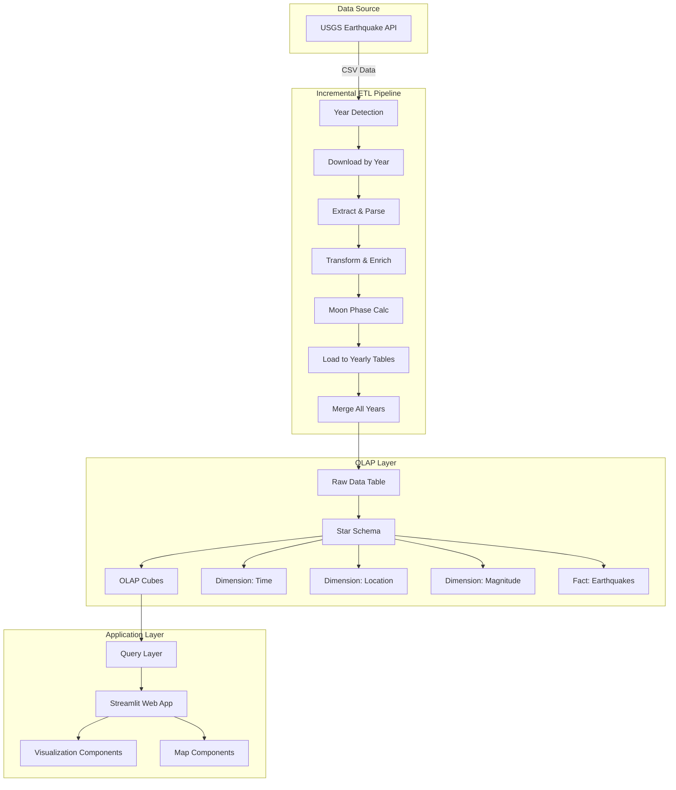
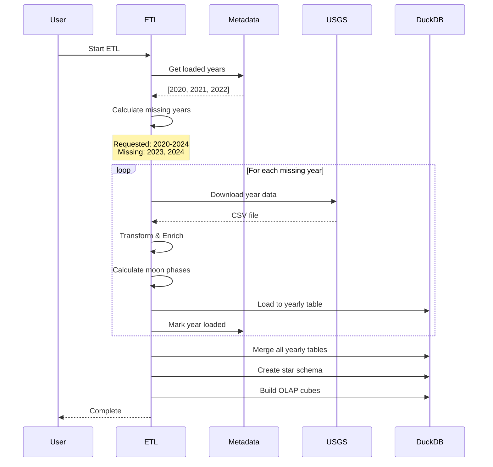
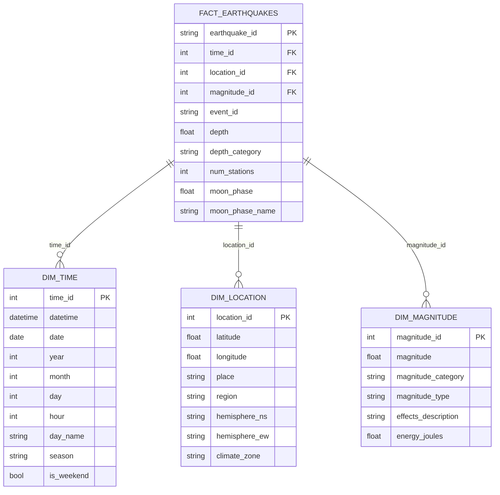

# 🌍 Earthquake OLAP Analytics Showcase

A comprehensive data engineering and analytics project demonstrating the power of **open-source tools** for OLAP (Online Analytical Processing) using earthquake data from USGS.


## 📋 Table of Contents

- [Overview](#overview)
- [Features](#features)
- [Technology Stack](#technology-stack)
- [Architecture](#architecture)
- [Project Structure](#project-structure)
- [Getting Started](#getting-started)
  - [Prerequisites](#prerequisites)
  - [Local Installation](#local-installation)
  - [Docker Installation](#docker-installation)
- [Usage](#usage)
  - [Incremental ETL](#incremental-etl)
  - [Data Management](#data-management)
  - [Running the Application](#running-the-application)
- [Data Source](#data-source)
- [Visualizations](#visualizations)
- [Benchmarking](#benchmarking)
- [Testing](#testing)
- [Configuration](#configuration)
- [Performance Optimization](#performance-optimization)
- [Troubleshooting](#troubleshooting)
- [Contributing](#contributing)
- [License](#license)
- [Acknowledgments](#acknowledgments)

## 🎯 Overview

This project showcases how **open-source tools** can replace commercial data engineering and BI solutions, demonstrating:

- **Incremental ETL Pipeline** - Year-by-year processing with smart caching
- **OLAP Database** - High-performance analytics with DuckDB
- **Data Visualization** - Interactive dashboards with Streamlit and Plotly
- **Dimensional Modeling** - Star schema with fact and dimension tables
- **Performance Tracking** - Built-in benchmarking and monitoring
- **Moon Phase Analysis** - Correlation analysis between lunar cycles and seismic activity

**Perfect for:**

- Data engineers learning modern open-source tools
- Teams evaluating alternatives to commercial BI platforms
- Educational demonstrations of OLAP concepts
- Portfolio projects showcasing data engineering skills

## ✨ Features

### 📊 Data Processing

- ✅ **Incremental ETL** - Process data year by year, only load new data
- ✅ **Smart caching** - Reuse downloaded and processed data
- ✅ **Automatic chunking** - Split large date ranges into manageable pieces
- ✅ **Data validation** - Quality checks and error handling
- ✅ **Deduplication** - Automatic removal of duplicate events
- ✅ **Parquet export** - Efficient columnar storage format
- ✅ **Moon phase enrichment** - Calculate lunar phase for each earthquake

### 🗄️ OLAP Analytics

- ✅ **Star schema** - Dimension and fact tables for efficient queries
- ✅ **Pre-aggregated cubes** - Fast analytical queries
- ✅ **Multiple dimensions** - Time, location, magnitude, moon phase
- ✅ **Complex analytics** - Temporal trends, regional patterns, depth analysis
- ✅ **Optimized for large datasets** - Handle millions of rows efficiently

### 📈 Interactive Visualizations

- ✅ **Overview Dashboard** - Key metrics and summary statistics
- ✅ **Temporal Analysis** - Daily trends, hourly patterns, seasonal variations, day-of-week distribution
- ✅ **Magnitude Analysis** - Distribution, depth relationships, energy release
- ✅ **Regional Analysis** - Geographic patterns and comparisons
- ✅ **Interactive Maps** - Global view, clustered markers, density heatmaps
- ✅ **Moon Phase Analysis** - Polar charts showing earthquake distribution by lunar cycle
- ✅ **Dynamic Filters** - Magnitude, date range, with persistent state
- ✅ **Dark Mode** - Professional dark theme optimized for data visualization

### 🐳 Deployment

- ✅ **Docker containerization** - One-command deployment
- ✅ **Docker Compose** - Complete orchestration
- ✅ **Automatic ETL** - Runs on first start, incremental on restart
- ✅ **Health checks** - Monitor application status
- ✅ **Volume mounting** - Persist data between restarts
- ✅ **Hot reload** - Code changes reflect immediately

### 🧪 Quality Assurance

- ✅ **Unit and integration tests** - Comprehensive test coverage
- ✅ **Code coverage tracking** - 60%+ target
- ✅ **Type hints** - Full type safety with Pylance
- ✅ **Linting** - Code quality with Ruff
- ✅ **Performance benchmarking** - Track metrics across runs

## 🛠️ Technology Stack

| Component | Technology | Purpose |
|:----------|:-----------|:--------|
| **Language** | Python 3.11 | Core programming language |
| **Database** | DuckDB | In-process OLAP database |
| **Data Processing** | Polars + Pandas | Fast data transformations |
| **Web Framework** | Streamlit | Interactive web application |
| **Visualization** | Plotly + Folium | Charts and interactive maps |
| **HTTP Client** | httpx | Async-capable data downloads |
| **Validation** | Pydantic | Type-safe configuration |
| **Astronomy** | Skyfield | Moon phase calculations |
| **Testing** | pytest + pytest-cov | Unit and integration tests |
| **Containerization** | Docker + Docker Compose | Reproducible deployment |

### Why These Tools?

This stack demonstrates how open-source alternatives can replace commercial solutions:

| Commercial Tool | Open-Source Alternative | This Project |
|:----------------|:------------------------|:-------------|
| SQL Server | **DuckDB** | ✅ |
| SSIS / Data Factory | **Python + Polars** | ✅ |
| Power BI | **Streamlit + Plotly** | ✅ |
| Tableau | **Streamlit + Folium** | ✅ |

## 🏗️ Architecture

### System Architecture



### Incremental ETL Flow



### Star Schema Design



## 📁 Project Structure

```bash
earthquake-olap-showcase/
│
├── .streamlit/                   # Streamlit configuration
│   └── config.toml              # Theme and server settings
│
├── data/                         # Data directory (gitignored)
│   ├── raw/                      # Downloaded CSV files by year
│   ├── processed/                # Parquet files
│   ├── duckdb/                   # DuckDB database and temp files
│   └── metadata.json             # Incremental loading metadata
│
├── src/                          # Source code
│   ├── etl/                      # ETL pipeline
│   │   ├── download.py           # Multi-year download with chunking
│   │   ├── extract.py            # CSV parsing and combination
│   │   ├── transform.py          # Data cleaning and moon phase enrichment
│   │   └── load.py               # DuckDB loading with optimization
│   │
│   ├── olap/                     # OLAP layer
│   │   ├── schema.py             # Star schema with optimized joins
│   │   ├── cube.py               # OLAP cubes including moon phase
│   │   └── queries.py            # Analytical queries
│   │
│   ├── app/                      # Streamlit application
│   │   ├── main.py               # Main app entry point
│   │   ├── pages/                # Multi-page app
│   │   │   ├── 1_overview.py     # Key metrics and summaries
│   │   │   ├── 2_analysis.py     # Temporal and magnitude analysis
│   │   │   ├── 3_maps.py         # Interactive earthquake maps
│   │   │   └── 4_moon_phase.py   # Lunar cycle correlation
│   │   └── components/           # Reusable UI components
│   │       ├── charts.py         # Chart generation functions
│   │       └── filters.py        # Filter components
│   │
│   ├── benchmark/                # Performance tracking
│   │   └── metrics.py            # Benchmark tracking and reporting
│   │
│   └── utils/                    # Utilities
│       ├── config.py             # Configuration management
│       ├── logger.py             # Logging setup
│       └── data_manager.py       # Incremental loading metadata
│
├── tests/                        # Test suite
│   ├── test_etl/                 # ETL tests
│   ├── test_olap/                # OLAP tests
│   └── test_benchmark/           # Benchmark tests
│
├── scripts/                      # Standalone scripts
│   ├── run_etl.py                # Full ETL pipeline (single run)
│   ├── run_etl_incremental.py    # Incremental ETL (year by year)
│   ├── run_benchmark.py          # Performance benchmarks
│   └── test_*.py                 # Test scripts
│
├── config/                       # Configuration files
│   ├── config.yaml               # Main configuration
│   └── logging.yaml              # Logging configuration
│
├── docker/                       # Docker files
│   ├── Dockerfile                # Multi-stage build
│   └── entrypoint.sh             # Container startup script
│
├── benchmark_results/            # Benchmark outputs (gitignored)
├── logs/                         # Application logs (gitignored)
│
├── .gitignore
├── .dockerignore
├── docker-compose.yml
├── pyproject.toml                # Project metadata
├── requirements.txt              # Pinned dependencies
├── pytest.ini                    # Pytest configuration
├── Makefile                      # Common commands
├── LICENSE
└── README.md                     # This file
```

## 🚀 Getting Started

### Prerequisites

- **Python 3.11+**
- **Docker** (optional, for containerized deployment)
- **16GB RAM recommended** (8GB minimum)
- **50GB free disk space** (for large datasets and temp files)
- **Internet connection** (for downloading earthquake data)

### Local Installation

1. **Clone the repository**

    ```bash
    git clone https://github.com/dtc77ai/earthquake-olap-showcase.git
    cd earthquake-olap-showcase
    ```

1. **Create virtual environment**

    ```bash
    python3.11 -m venv venv
    source venv/bin/activate  # On Windows: venv\Scripts\activate
    ```

1. **Install dependencies**

    ```bash
    pip install -r requirements.txt

    # Optional: Install watchdog for faster development
    pip install watchdog
    ```

1. **Set up the project**

    ```bash
    make setup
    ```

1. **Configure data range**

    Edit `config/config.yaml`:

    ```yaml
    data_source:
    years_to_load: [2020, 2021, 2022, 2023, 2024]  # Specify years
    params:
        minmagnitude: 5.5  # Adjust magnitude filter
    ```

1. **Run the incremental ETL pipeline**

    ```bash
    python scripts/run_etl_incremental.py
    ```

    This will:

    - Download earthquake data year by year
    - Transform and enrich with moon phases
    - Load into DuckDB with yearly partitioning
    - Merge all years into unified tables
    - Create star schema and OLAP cubes
    - Generate benchmark report

    **Expected time:** 10-20 minutes per year (depending on data volume and system specs, but if magnitude is above 5.5 each year takes only a couple minutes)

1. **Start the application**

    ```bash
    streamlit run src/app/main.py
    ```

    The app will open in your browser at `http://localhost:8501`

### Docker Installation (Recommended)

**Easiest way to get started!**

1. **Clone the repository**

    ```bash
    git clone https://github.com/dtc77ai/earthquake-olap-showcase.git
    cd earthquake-olap-showcase
    ```

1. **Configure data range**

    Edit `config/config.yaml`:

    ```yaml
    data_source:
    years_to_load: [2020, 2021, 2022, 2023, 2024]
    params:
        minmagnitude: 2.5
    ```

1. **Build and run with Docker Compose**

    ```bash
    make docker-init
    ```

    Or manually:

    ```bash
    docker-compose build
    docker-compose up -d
    ```

1. **Monitor progress**

    ```bash
    make docker-logs
    ```

    The first run will automatically:

    - Download earthquake data for specified years
    - Process each year incrementally
    - Calculate moon phases
    - Create OLAP structures
    - Start the Streamlit app

1. **Access the application**

    Open your browser to `http://localhost:8501`

1. **Stop the application**

    ```bash
    make docker-down
    ```

## 📖 Usage

### Makefile Commands

```bash
# Setup and Installation
make setup              # Initial project setup
make install            # Install production dependencies
make install-dev        # Install development dependencies

# Running the Application
make run                # Run Streamlit app locally
make etl                # Run full ETL pipeline (single run)
make etl-incremental    # Run incremental ETL (year by year)
make benchmark          # Run performance benchmarks

# Data Management
make etl-status         # Show loaded data status
make etl-reset-year YEAR=2020  # Reset specific year
make etl-reset-all      # Reset all metadata
make clean-db           # Clean database (keeps raw downloads)
make clean-all-data     # Clean everything (with confirmation)
make refresh-data       # Clean and re-run ETL

# Testing
make test               # Run all tests
make test-unit          # Run unit tests only
make coverage           # Generate coverage report

# Code Quality
make lint               # Run linter
make format             # Format code with black

# Docker
make docker-build       # Build Docker image
make docker-up          # Start containers (detached)
make docker-run         # Start containers (foreground)
make docker-down        # Stop containers
make docker-logs        # View logs
make docker-restart     # Restart containers
make docker-clean       # Remove containers and volumes
make docker-shell       # Open bash in container
make docker-rebuild     # Clean rebuild (use it after making changes to code or etl)
make docker-init        # Build + start (one command)

# Cleanup
make clean              # Clean generated files
```

### Incremental ETL

The incremental ETL system allows you to:

- Process data year by year for better performance
- Add new years without reprocessing old ones
- Handle non-consecutive years (e.g., 2015, 2018-2020, 2024)
- Resume from failures
- Track what's been loaded

**Basic workflow:**

```bash
# 1. Configure years in config.yaml
years_to_load: [2020, 2021, 2022, 2023, 2024]

# 2. Run incremental ETL
python scripts/run_etl_incremental.py

# 3. Add more years later
years_to_load: [2015, 2020, 2021, 2022, 2023, 2024, 2025]

# 4. Run again - only processes 2015 and 2025
python scripts/run_etl_incremental.py
```

**How it works:**

1. **Metadata tracking** - `data/metadata.json` tracks loaded years
2. **Yearly tables** - Each year stored in `raw_earthquakes_YYYY`
3. **Smart merging** - Combines all yearly tables into `raw_earthquakes`
4. **Validation** - Checks if yearly tables actually exist
5. **Auto-recovery** - Reprocesses missing years automatically

### Data Management

**Check what's loaded:**

```bash
make etl-status

# Output:
# {
#   "total_years": 5,
#   "loaded_years": [2020, 2021, 2022, 2023, 2024],
#   "total_events": 2710,
#   "last_updated": "2024-11-01T12:00:00"
# }
```

**Reset a specific year:**

```bash
# Clear year 2023 (will be reprocessed on next run)
make etl-reset-year YEAR=2023

# Run ETL - only reprocesses 2023
python scripts/run_etl_incremental.py
```

**Reset everything:**

```bash
# Clear all metadata
make etl-reset-all

# Clean database
make clean-db

# Run ETL - processes all configured years
python scripts/run_etl_incremental.py
```

### Running the Application

**Local:**

```bash
streamlit run src/app/main.py
```

**Docker:**

```bash
# Start in background
make docker-up

# View logs
make docker-logs

# Stop
make docker-down
```

**Adding new years (Docker):**

```bash
# 1. Edit config/config.yaml - add new years
# 2. Restart container
make docker-restart

# 3. Watch it process only new years
make docker-logs
```

## 🌐 Data Source

**USGS Earthquake Hazards Program:**

- **Provider**: United States Geological Survey
- **API**: <https://earthquake.usgs.gov/fdsnws/event/1/>
- **Update Frequency**: Real-time
- **Coverage**: Global
- **Data Quality**: High (authoritative source)
- **Historical Data**: Available from 1900s to present

### Data Fields

The dataset includes:

- **Time**: Timestamp, date components, temporal patterns
- **Location**: Latitude, longitude, place, region
- **Magnitude**: Value, type, category, energy release
- **Depth**: Depth in km, depth category (shallow/intermediate/deep)
- **Quality Metrics**: Number of stations, azimuthal gap, errors
- **Moon Phase**: Lunar cycle phase and name (calculated)

### Typical Dataset Size

| Time Range | Magnitude Filter | Rows (approx.) | Download Size | Processing Time |
|:-----------|:-----------------|:---------------|:--------------|:----------------|
| 1 year | ≥ 2.5 | 500,000 | ~100 MB | 10-15 min |
| 1 year | ≥ 4.0 | 15,000 | ~3 MB | 2-3 min |
| 1 year | ≥ 5.5 | 500 | ~100 KB | 1-2 min |
| 5 years | ≥ 2.5 | 2,500,000 | ~500 MB | 50-75 min |
| 5 years | ≥ 5.5 | 2,500 | ~500 KB | 5-10 min |

**Performance tip:** For large datasets (millions of rows), use higher magnitude filters (≥ 4.0) for faster processing.

## 📊 Visualizations

### 1. Overview Dashboard

**Key Metrics:**

- Total earthquakes
- Date range coverage
- Average and maximum magnitude
- Top magnitude events table
- Regional statistics

**Charts:**

- Magnitude distribution by category
- Depth analysis (events and average magnitude)

### 2. Analysis Page

#### Temporal Tab

- **Daily Activity Trends** - Time series of earthquake frequency
- **Day of Week Distribution** - Dual-axis chart (event count + avg magnitude)
- **Hourly Patterns** - Polar chart showing 24-hour distribution
- **Seasonal Patterns** - Comparison across seasons

#### Magnitude Tab

- **Distribution Pie Chart** - Events by magnitude category
- **Magnitude vs Depth Scatter** - 3D relationship visualization
- **Category Statistics** - Detailed breakdown

#### Regional Tab

- **Top N Active Regions** - Horizontal bar chart (configurable)
- **Regional Comparison** - Event counts and magnitudes
- **Statistics Table** - Detailed regional metrics

#### Energy Tab

- **Energy Release Timeline** - Logarithmic scale visualization
- **Total/Average/Max Energy** - Key metrics
- **Scientific Context** - Educational information

### 3. Maps Page

**Features:**

- **Magnitude filter** - 0.0 to 10.0 (persistent across navigation)
- **Date range filter** - Select specific time periods
- **Event limit** - Control number of markers (100-5,000)
- **Three visualization modes:**

#### Global View

- Circle markers sized by magnitude
- Color-coded by magnitude category
- Interactive popups with event details
- Legend with magnitude ranges

#### Clustered View

- Automatic marker clustering
- Zoom in to see individual events
- Cluster counts at different zoom levels
- Performance-optimized for large datasets

#### Heatmap

- Density visualization weighted by magnitude
- Gradient from blue (low) to red (high)
- Shows tectonic plate boundaries
- Reveals seismic activity patterns

### 4. Moon Phase Analysis

**Unique Features:**

- **Polar chart** - Circular representation of lunar cycle
- **Magnitude grouping** - 5 groups (1-3, 4, 5, 6-7, 8-9)
- **Color coding** - Green to purple gradient
- **Statistics table** - Events by moon phase
- **Scientific context** - Educational information about tidal forces

**Insights:**

- Explore potential correlation between lunar cycles and earthquakes
- Compare different magnitude ranges
- Identify patterns in your dataset
- Educational tool for understanding tidal forces

### Filters

All visualizations support dynamic filtering:

- **Minimum Magnitude** - 0.0 to 10.0 (all pages)
- **Date Range** - Start and end date (Maps page)
- **Maximum Events** - Display limit (Maps page)
- **Stateful** - Filters persist across page navigation

## ⚡ Benchmarking

The project includes comprehensive benchmarking:

### Tracked Metrics

**Per-Year Metrics:**

- Download time
- File size
- Extraction time
- Transformation time (including moon phase calculation)
- Load time
- Row counts

**Overall Metrics:**

- Total pipeline duration
- OLAP schema creation time
- OLAP cube building time
- Memory usage
- Compression ratios
- Database size

### Sample Benchmark Results

```bash
📊 Benchmark Summary
┏━━━━━━━━━━━━━━━━━━━━━┳━━━━━━━━━━━┳━━━━━━━━━━━━━━━━━━━━━━━━━━━━━━┓
┃ Metric              ┃ Duration  ┃ Details                      ┃
┡━━━━━━━━━━━━━━━━━━━━━╇━━━━━━━━━━━╇━━━━━━━━━━━━━━━━━━━━━━━━━━━━━━┩
│ download_2024       │ 12.34s    │                              │
│ extract_2024        │ 3.45s     │                              │
│ transform_2024      │ 145.67s   │ (includes moon phase calc)   │
│ load_2024           │ 2.11s     │                              │
│ olap_schema         │ 5.23s     │                              │
│ olap_cubes          │ 3.89s     │                              │
└─────────────────────┴───────────┴──────────────────────────────┘

Total Duration: 172.69s (2.88m)

Data Information:
  year_2024_raw_rows: 500,234
  year_2024_transformed_rows: 498,123
  fact_earthquakes_rows: 498,123
  compression_ratio_percent: 68.45%
```

**Benchmark files** are saved to `benchmark_results/` with timestamps for comparison across runs.

## 🧪 Testing

### Run Tests

```bash
# All tests
make test

# Unit tests only
make test-unit

# With coverage report
make coverage
```

### Test Structure

```bash
tests/
├── conftest.py              # Pytest fixtures
├── test_etl/
│   ├── test_download.py     # Download module tests
│   ├── test_extract.py      # Extraction tests
│   └── test_transform.py    # Transformation tests
├── test_olap/
│   └── test_queries.py      # Query tests
└── test_benchmark/
    └── test_metrics.py      # Benchmark tests
```

### Coverage Target

- **Minimum**: 60%
- **Target**: 70-80%
- **Excluded**: Streamlit UI components (hard to test)

## ⚙️ Configuration

### Main Configuration (`config/config.yaml`)

```yaml
# Application settings
app:
  name: "Earthquake OLAP Analytics"
  version: "0.1.0"
  debug: false

# Data source configuration
data_source:
  name: "USGS Earthquake Data"
  base_url: "https://earthquake.usgs.gov/fdsnws/event/1/query"
  
  # Specify years to load (incremental approach)
  years_to_load: [2020, 2021, 2022, 2023, 2024]
  
  # Query parameters
  params:
    format: "csv"
    minmagnitude: 2.5  # Filter earthquakes by magnitude
    orderby: "time-asc"
  
  use_api: true

# DuckDB configuration
duckdb:
  database: "earthquakes.duckdb"
  memory_limit: "8GB"
  threads: 4
  temp_directory: "data/duckdb/temp"
  max_temp_directory_size: "50GB"
  preserve_insertion_order: false  # Better performance

# ETL configuration
etl:
  chunk_size: 100000
  download_timeout: 300
  retry_attempts: 3
  retry_delay: 5

# Streamlit configuration
streamlit:
  page_title: "🌍 Earthquake OLAP Analytics"
  layout: "wide"
  initial_sidebar_state: "expanded"
```

### Streamlit Theme (`.streamlit/config.toml`)

```toml
[theme]
base = "dark"
primaryColor = "#FF4B4B"
backgroundColor = "#0E1117"
secondaryBackgroundColor = "#262730"
textColor = "#FAFAFA"
font = "sans serif"

[server]
port = 8501
address = "0.0.0.0"
headless = true
```

### Adjusting Data Range

**Option 1: Specific years (recommended):**

```yaml
data_source:
  years_to_load: [2015, 2018, 2019, 2020, 2024]  # Non-consecutive OK
```

**Option 2: Year range:**

```yaml
data_source:
  start_year: 2020
  end_year: 2024  # Loads 2020, 2021, 2022, 2023, 2024
```

**Option 3: Magnitude filtering:**

```yaml
data_source:
  params:
    minmagnitude: 4.0  # Only earthquakes ≥ 4.0
    # Higher magnitude = fewer events = faster processing
```

## 🚀 Performance Optimization

### For Large Datasets (Millions of Rows)

1. **Use incremental ETL** - Process year by year

    ```bash
    python scripts/run_etl_incremental.py
    ```

1. **Increase magnitude filter** - Reduce data volume

    ```yaml
    params:
    minmagnitude: 4.0  # Instead of 2.5
    ```

1. **Adjust DuckDB settings** - Optimize for your system

    ```yaml
    duckdb:
    memory_limit: "16GB"  # Increase if you have RAM
    threads: 8            # Match your CPU cores
    max_temp_directory_size: "100GB"  # Ensure enough temp space
    ```

1. **Monitor disk space** - DuckDB uses temp files

    ```bash
    # Check temp directory size
    du -sh data/duckdb/temp/
    ```

### Moon Phase Calculation

Moon phase calculation is the slowest part of the pipeline. For large datasets:

- **Process year by year** - Incremental ETL handles this automatically
- **Expected time**: ~2-3 minutes per 100,000 events
- **First run downloads ephemeris** - ~17MB, cached for future runs

### Query Performance

- **Use filters** - Magnitude and date filters reduce query time
- **Limit map events** - Default 1,000 events for responsive maps
- **Pre-aggregated cubes** - Most queries use cubes, not raw data

## 🐛 Troubleshooting

### Issue: "Out of Memory" during fact table creation

**Solution:**

```yaml
# Increase temp directory size
duckdb:
  max_temp_directory_size: "100GB"
  
# Or reduce data volume
data_source:
  params:
    minmagnitude: 4.0  # Higher magnitude filter
```

### Issue: Incorrect row counts in UI

**Cause:** Metadata out of sync with actual database

**Solution:**

```bash
# Validate and fix metadata
make docker-shell
python -c "
import duckdb
from src.utils.data_manager import DataManager
from src.utils.config import get_config

config = get_config()
conn = duckdb.connect(str(config.get_duckdb_path()))
dm = DataManager()
dm.validate_loaded_years(conn)
conn.close()
"
exit

# Restart
make docker-restart
```

### Issue: Yearly tables missing after restart

**Cause:** Tables were cleaned up but metadata wasn't updated

**Solution:**

```bash
# Reset metadata and reprocess
make etl-reset-all
make docker-restart
```

### Issue: Moon phase calculation is slow

**Expected:** 2-3 minutes per 100,000 events

**Solutions:**

- Use incremental ETL (processes year by year)
- Increase magnitude filter to reduce event count
- First run downloads ephemeris (~17MB) - subsequent runs are faster

### Issue: Maps not loading

**Cause:** Too many events to display

**Solution:**

- Increase minimum magnitude filter
- Reduce "Maximum Events to Display" slider
- Use date range filter to limit time period

### Issue: Docker container keeps restarting

**Check logs:**

```bash
make docker-logs
```

**Common causes:**

- ETL pipeline failing (check error in logs)
- Out of disk space (check `df -h`)
- Port 8501 already in use (stop other Streamlit apps)

## 🔄 Docker Workflows

### Making UI Changes

```bash
# Edit files in src/app/
# Save changes
# Refresh browser (Streamlit auto-reloads)

# If auto-reload doesn't work:
make docker-restart
```

### Refreshing Data with New Configuration

```bash
# 1. Stop container
make docker-down

# 2. Edit config/config.yaml
#    Update years_to_load or minmagnitude

# 3. Clean database (keeps raw downloads)
make clean-db

# 4. Start container (ETL runs automatically)
make docker-up

# 5. Watch progress
make docker-logs
```

### Adding More Years (Incremental)

```bash
# 1. Edit config/config.yaml
#    Add new years to years_to_load

# 2. Restart container
make docker-restart

# 3. Watch it process only new years
make docker-logs
```

### Complete Reset

```bash
# Nuclear option - start completely fresh
make docker-down
make clean-all-data
make etl-reset-all
make docker-rebuild
```

## 🤝 Contributing

Contributions are welcome! Please follow these guidelines:

1. **Fork the repository**
2. **Create a feature branch** (`git checkout -b feature/amazing-feature`)
3. **Make your changes**
4. **Run tests** (`make test`)
5. **Run linter** (`make lint`)
6. **Format code** (`make format`)
7. **Commit your changes** (`git commit -m 'feat: add amazing feature'`)
8. **Push to the branch** (`git push origin feature/amazing-feature`)
9. **Open a Pull Request**

### Code Style

- Follow PEP 8
- Use type hints throughout
- Add docstrings (Google style)
- Keep functions focused and small
- Write tests for new features
- Update README for new features

### Commit Messages

Use conventional commits:

- `feat:` New feature
- `fix:` Bug fix
- `docs:` Documentation changes
- `test:` Test changes
- `refactor:` Code refactoring
- `perf:` Performance improvements
- `chore:` Maintenance tasks

## 📄 License

This project is licensed under the MIT License - see the [LICENSE](LICENSE) file for details.

## 🙏 Acknowledgments

- **USGS Earthquake Hazards Program** - For providing high-quality, real-time earthquake data
- **DuckDB Team** - For creating an amazing OLAP database
- **Streamlit Team** - For making data apps incredibly easy to build
- **Polars Team** - For blazing-fast data processing
- **Skyfield Team** - For accurate astronomical calculations
- **Open Source Community** - For all the incredible tools used in this project

## 📞 Contact

**Author**: dtc77ai

**GitHub**: [@dtc77ai](https://github.com/dtc77ai)

**Project Link**: [https://github.com/dtc77ai/earthquake-olap-showcase](https://github.com/dtc77ai/earthquake-olap-showcase)

---

## 🎯 Project Goals

This project was created to:

1. **Demonstrate** that open-source tools can replace commercial BI platforms
2. **Educate** data engineers on modern OLAP concepts and techniques
3. **Showcase** best practices in data engineering and visualization
4. **Provide** incremental loading patterns for large datasets
5. **Inspire** others to build with open-source tools
6. **Serve** as a template for similar analytics projects

## 🚀 Key Innovations

### Incremental Data Loading

Unlike traditional ETL that reprocesses everything:

- ✅ **Year-by-year processing** - Handle large date ranges efficiently
- ✅ **Smart caching** - Only process new data
- ✅ **Metadata tracking** - Know what's been loaded
- ✅ **Gap handling** - Support non-consecutive years
- ✅ **Auto-recovery** - Detect and fix missing data

### Moon Phase Enrichment

Unique feature that adds astronomical context:

- ✅ **Skyfield integration** - Accurate lunar phase calculations
- ✅ **8 phase categories** - From New Moon to Waning Crescent
- ✅ **Polar visualization** - Intuitive circular representation
- ✅ **Scientific context** - Educational information included

### Performance at Scale

Optimized for millions of rows:

- ✅ **Columnar storage** - Parquet for intermediate files
- ✅ **Optimized joins** - Prevent Cartesian products
- ✅ **Temp file management** - Configurable temp directory
- ✅ **Memory limits** - Prevent OOM errors
- ✅ **Parallel processing** - Multi-threaded where possible

## 📚 Learning Resources

If you're new to these technologies:

- **DuckDB**: [duckdb.org/docs](https://duckdb.org/docs/)
- **Streamlit**: [docs.streamlit.io](https://docs.streamlit.io/)
- **Polars**: [pola-rs.github.io/polars-book](https://pola-rs.github.io/polars-book/)
- **OLAP Concepts**: [Wikipedia - OLAP](https://en.wikipedia.org/wiki/Online_analytical_processing)
- **Star Schema**: [Kimball Dimensional Modeling](https://www.kimballgroup.com/data-warehouse-business-intelligence-resources/kimball-techniques/dimensional-modeling-techniques/)
- **Skyfield**: [rhodesmill.org/skyfield](https://rhodesmill.org/skyfield/)

## 🎓 Educational Value

This project teaches:

- **ETL Design Patterns** - Incremental loading, error handling, validation
- **OLAP Concepts** - Star schema, dimensions, facts, cubes
- **Data Visualization** - Interactive dashboards, maps, charts
- **Performance Optimization** - Memory management, query optimization
- **Docker Deployment** - Containerization, orchestration
- **Code Quality** - Type hints, testing, documentation
- **Astronomical Calculations** - Moon phase determination

## 🌟 Future Enhancements

Potential improvements:

- [ ] Real-time data streaming with WebSocket updates
- [ ] Machine learning for earthquake pattern detection
- [ ] Tectonic plate boundary overlays on maps
- [ ] Aftershock sequence detection and visualization
- [ ] API endpoint for programmatic access
- [ ] Multi-language support (i18n)
- [ ] Export functionality (PDF reports, CSV downloads)
- [ ] User authentication and saved views
- [ ] Comparison with historical baseline patterns
- [ ] Integration with other seismic data sources

---

## 📖 Additional Documentation

- [Streamlit Development Guide](docs/STREAMLIT_GUIDE.md) - Learn how to build Streamlit apps
- [Architecture Deep Dive](docs/ARCHITECTURE.md) - Detailed system design (coming soon)
- [API Documentation](docs/API.md) - Query layer reference (coming soon)
